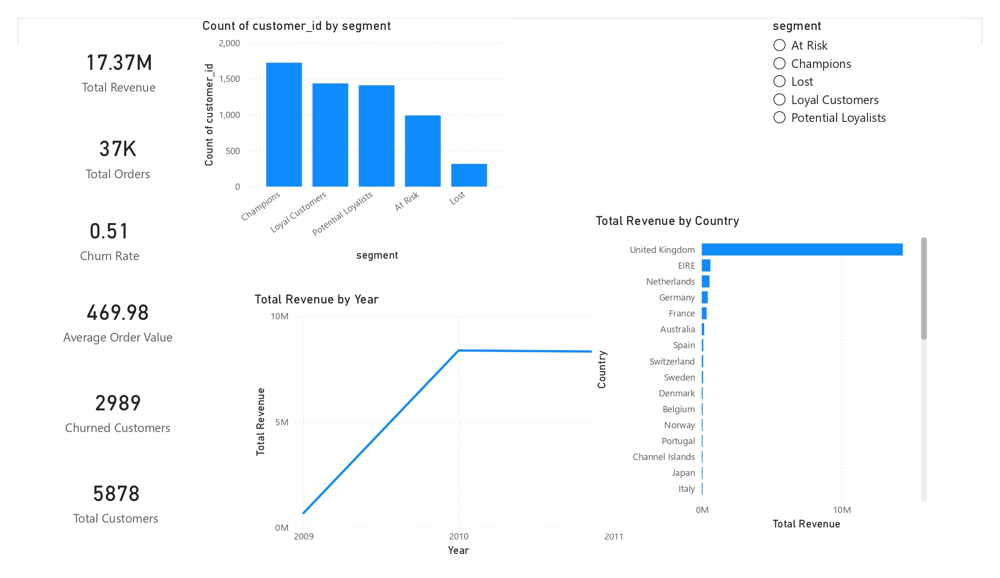
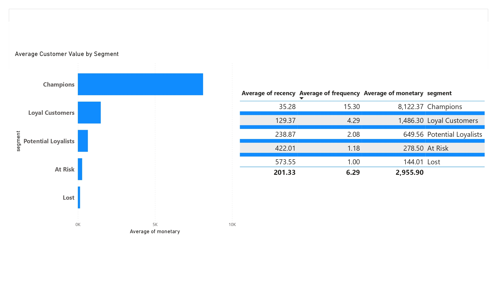
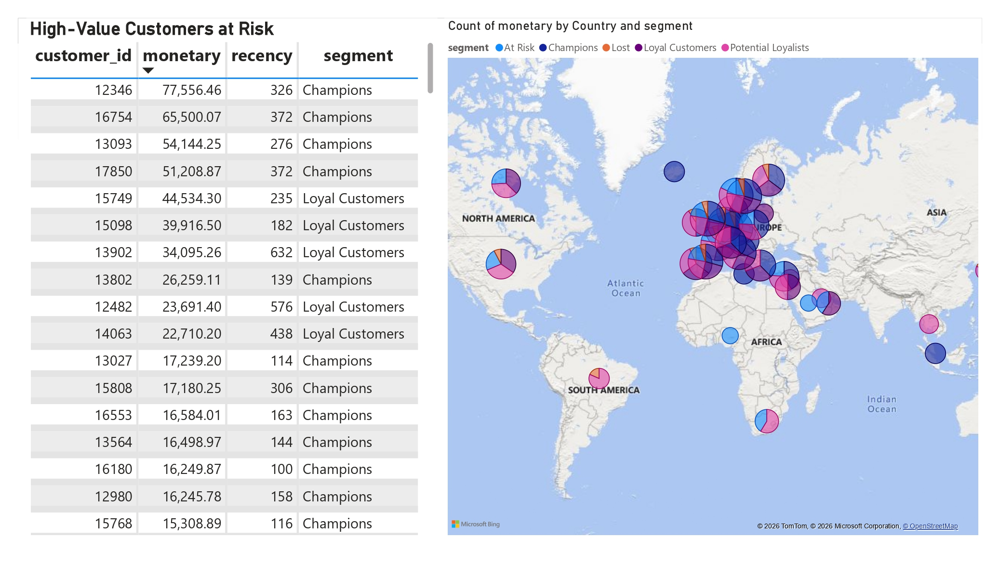

## Power BI Customer Segmentation Dashboard (Churn & Revenue)

Problem:
Businesses don’t know which customers are at risk of churn and which drive revenue.

Solution:
Built an interactive Power BI dashboard using RFM segmentation to identify:
- High-value customers at risk
- Revenue-driving customer segments
- Country-wise churn patterns

Tools:
Power BI | SQL | Python

Outcome:
Helps businesses take targeted actions to reduce churn and increase revenue.

---

##  DATASET USED

- **Dataset**: Online Retail II (UK-based e-commerce transactions)
- **Type**: Real transactional data
- **Records**: 780,000+ transactions
- **Time Period**: 2009–2011
- **Key Fields**:
  - Invoice
  - Customer ID
  - Invoice Date
  - Quantity
  - Unit Price
  - Country

📌 *The dataset was cleaned, validated, and transformed before analysis.*

---

## 🚀 WHAT THIS PROJECT COVERS

### ✅ Business Problem Definition
- Revenue understanding
- Customer value identification
- Churn & inactivity analysis
- Country-wise business performance

### ✅ Data Cleaning & Validation (Python)
- Removed cancelled invoices
- Removed invalid quantities & prices
- Handled missing customer IDs
- Deduplicated transactions
- Created validated transaction-level dataset

### ✅ Exploratory Data Analysis (EDA)
- Revenue distribution & trends
- Country-wise revenue contribution
- Product-level performance
- Year-wise revenue growth

### ✅ Customer Segmentation (RFM Analysis)
Customers are segmented using:
- **Recency** – How recently a customer purchased  
- **Frequency** – How often they purchased  
- **Monetary** – How much revenue they generated  

Segments created:
- Champions
- Loyal Customers
- Potential Loyalists
- At Risk
- Lost Customers

---

## 📊 POWER BI DASHBOARD (FREE VERSION)

Power BI Desktop (Free) is used as the **presentation & decision-making layer**.

## 📊 Power BI Dashboard Preview

### Customer Segmentation

### Executive Overview

### Churn & Risk Analysis

### Dashboard Pages:

#### 🔹 Page 1: Executive Overview
- Total Revenue
- Total Customers
- Total Orders
- Average Order Value
- Churn Rate
- Revenue by Country
- Customer Distribution by Segment
- Segment slicer for interactivity

#### 🔹 Page 2: Customer Segmentation Deep Dive
- Average Customer Value by Segment
- RFM metrics table (Recency, Frequency, Monetary)
- Segment-based comparison

#### 🔹 Page 3: Churn & Risk Analysis
- High-value customers inactive for 90+ days
- At-risk revenue identification
- Country-wise customer risk visualization (Map)

📌 Power BI is used only for **visualization**, while all logic is handled in Python.

---

## 📈 KEY BUSINESS KPIs

- Total Revenue : £17.37M
- Total Customers : 5,878
- Total Orders : 37K
- Average Order Value : £469.98
- Churn Rate : ~51%
- Churned Customers : 2,989

## 💡 KEY BUSINESS INSIGHTS

### 🔴 Critical Observations
- High churn rate indicates weak customer retention
- A small percentage of customers generate a large portion of revenue
- Majority of revenue comes from the UK

### 🟢 Opportunities
- Retention campaigns for high-value at-risk customers
- VIP programs for Champions & Loyal Customers
- Country-specific growth strategies

### 🟡 Quick Business Wins
- Win-back campaigns for inactive customers
- Segment-based marketing instead of mass campaigns
- Focus on top revenue-generating regions

### This project demonstrates:
- Business thinking
- Analytical depth
- Clean Python workflow
- Professional Power BI reporting

## 📜 License

This project is proprietary and protected by copyright law.

All rights are reserved by the author.  
No part of this project may be used, copied, modified, or distributed
without explicit written permission.

For usage or collaboration requests, please contact the author.
